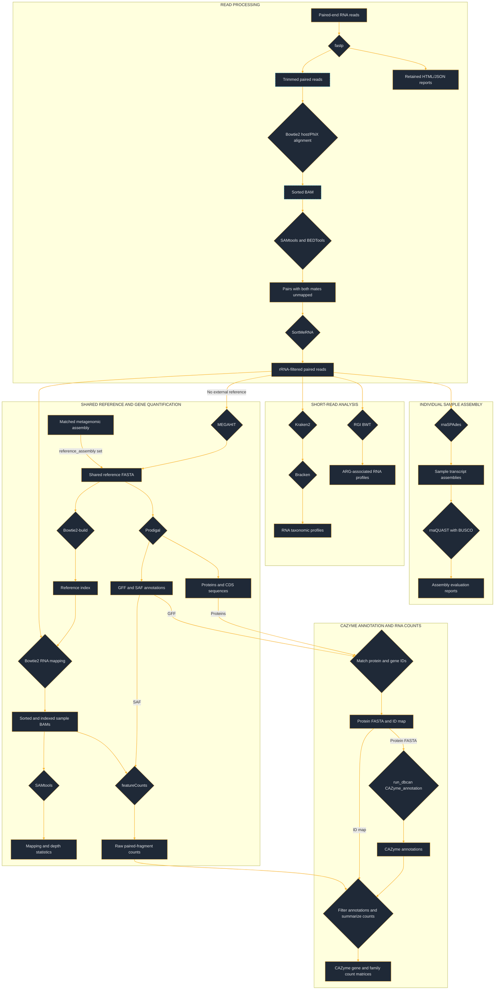

<!-- omit in toc -->
# METATRANSCRIPTOMICS SNAKEMAKE PIPELINE - USER GUIDE

---

<!-- omit in toc -->
## Table of Contents

- [Overview](#overview)
  - [Workflow diagram](#workflow-diagram)
  - [Snakemake rules](#snakemake-rules)
    - [Module `preprocessing.smk`](#module-preprocessingsmk)
    - [Module `sortmerna.smk`](#module-sortmernasmk)
    - [Module `taxonomy.smk`](#module-taxonomysmk)
    - [Module `amr_short_reads.smk`](#module-amr_short_readssmk)
    - [Module `sample_assembly.smk`](#module-sample_assemblysmk)
    - [Module `coassembly_annotation.smk`](#module-coassembly_annotationsmk)
    - [Module `db_can.smk`](#module-db_cansmk)
    - [Module `env_versions.smk`](#module-env_versionssmk)
- [Data](#data)
- [Parameters](#parameters)
- [Usage](#usage)
  - [Pre-requisites](#pre-requisites)
    - [Software](#software)
    - [Databases](#databases)
  - [Setup Instructions](#setup-instructions)
    - [1. Installation](#1-installation)
    - [2. SLURM Profile](#2-slurm-profile)
      - [2.1. SLURM Profile Directory Structure](#21-slurm-profile-directory-structure)
      - [2.2. Profile Configuration](#22-profile-configuration)
    - [3. Configuration](#3-configuration)
      - [3.1. config/config.yaml](#31-configconfigyaml)
      - [3.2. Environment file](#32-environment-file)
      - [3.3. Sample list](#33-sample-list)
      - [3.4. Scripts called in rules](#34-scripts-called-in-rules)
    - [4. Running the pipeline](#4-running-the-pipeline)
      - [4.1. Conda environments](#41-conda-environments)
      - [4.2. SLURM launcher](#42-slurm-launcher)
      - [4.3. Submit launcher to SLURM](#43-submit-launcher-to-slurm)
  - [Notes](#notes)
    - [Warnings](#warnings)
    - [Current issues](#current-issues)
    - [Resource usage](#resource-usage)
- [Output](#output)

---

## Overview

### Workflow diagram



### Snakemake rules

The pipeline is modularized, with each module located in the `metatranscriptomics-snakemake/workflow/rules` directory. The modules are `preprocessing.smk`, `sortmerna.smk`, `taxonomy.smk`,`amr_short_reads.smk`, `sample_assembly.smk`, `coassembly_annotation.smk`, and `env_versions.smk`.

---

#### Module `preprocessing.smk`

This module performs read-quality control, trimming and removal of reads originating from the host or PhiX control.

**Default configuration settings**

The following values are supplied in `config/config.yaml`. These workflow settings may differ from the default settings used by the individual software packages.

| Configuration setting | Default | Description |
|---|---:|---|
| `fastp: threads` | `2` | Number of threads used by *fastp*. |
| `fastp: cut_tail` | `true` | Enables sliding-window quality trimming from the 3′ end. |
| `fastp: cut_front` | `true` | Enables sliding-window quality trimming from the 5′ end. |
| `fastp: cut_mean_quality` | `20` | Minimum mean Phred quality required within the trimming window. |
| `fastp: cut_window_size` | `4` | Number of bases included in the sliding quality window. |
| `fastp: qualified_quality_phred` | `15` | Minimum Phred score used to define a qualified base. |
| `fastp: detect_adapter_for_pe` | `true` | Enables automatic adapter detection for paired-end reads. |
| `fastp: length_required` | `100` | Minimum read length retained after trimming. |
| `bowtie2_align: threads` | `12` | Total number of threads allocated among *Bowtie2* and *SAMtools*. |
| `extract_unmapped_fastq: threads` | `8` | Total number of threads allocated among *SAMtools*, *BEDTools*, and two *pigz* compressors. |

Quality-filtering parameters should be selected according to the sequencing platform, read length and study objectives.

**Rule: `fastp_pe` Quality Control & Trimming**

- **Purpose:** Uses *fastp* to perform adapter detection, adapter trimming, quality trimming, quality filtering, and length filtering of paired-end reads.
- **Inputs:**
- Paired-end fastq files specified for each sample in `samplesheet.csv`.
- **Outputs:**
  - Trimmed R1 reads: `sample_r1.fastq.gz`
  - Trimmed R2 reads: `sample_r2.fastq.gz`
  - Unpaired R1 reads: `sample_u1.fastq.gz`
  - Unpaired R2 reads: `sample_u2.fastq.gz`
  - HTML quality-control report: `sample.fastp.html`
  - JSON quality-control report: `sample.fastp.json`
- **Notes:**
  - Only the paired trimmed reads are used by subsequent preprocessing rules.
  - The four fastq outputs from this rule are marked with the Snakemake `temp()` function and are removed automatically when they are no longer required.
  - The HTML and JSON quality-control reports are retained automatically in the `fastp` subdirectory beneath the configured log directory.
  - To retain intermediate FASTQ files, remove `temp()` from the corresponding outputs in `workflow/rules/preprocessing.smk`.
  - The processing log is written to `fastp/sample.fastp.log` beneath the configured log directory.


**Rule: `bowtie2_align` — Host and PhiX alignment**

- **Purpose:** Aligns the trimmed paired reads against a user-supplied Bowtie2 index containing the relevant host genome sequence and PhiX reference sequence. The alignments are converted into a coordinate-sorted BAM file using *SAMtools*.
- **Inputs:**
  - Trimmed R1 reads: `sample_r1.fastq.gz`
  - Trimmed R2 reads: `sample_r2.fastq.gz`
  - Complete Bowtie2 index specified by `bowtie2_index` in `config/config.yaml`
- **Outputs:**
  - Coordinate-sorted alignment file: `bam/sample.bam`
- **Notes:**
  - The workflow currently declares the six `.bt2` index files; `.bt2l` large indexes are not currently supported by its input declarations.
  - Bowtie2 default alignment settings are used apart from the configured number of threads and the addition of a read-group ID and sample tag.
  - Available threads are divided among *Bowtie2* and *SAMtools*. The rule requires at least three allocated threads.
  - The BAM file is marked with `temp()` because it is an intermediate file used to recover host/PhiX-depleted paired reads.
  - The BAM contains both mapped and unmapped records.
  - The alignment log is written to `bowtie2/sample.log` beneath the configured log directory.

**Rule: `extract_unmapped_fastq` — Host and PhiX read removal**

- **Purpose:** Extracts paired reads for which neither mate aligned to the combined host and PhiX reference.
- **Inputs:**
  - Coordinate-sorted alignment file: `bam/sample.bam`
- **Outputs:**
  - Host/PhiX-depleted R1 reads: `sample_trimmed_clean_R1.fastq.gz`
  - Host/PhiX-depleted R2 reads: `sample_trimmed_clean_R2.fastq.gz`
- **Notes:**
  - *SAMtools* retains read pairs for which both mates are unmapped and excludes secondary and supplementary alignments.
  - Pairs with one mapped mate are excluded, even if the other mate is unmapped.
  - The retained BAM records are sorted by read name before *BEDTools* converts them back into paired fastq files.
  - The fastq files are compressed using *pigz*.
  - Available threads are divided among *SAMtools*, *BEDTools* and two *pigz* compressors. The rule requires at least five allocated threads.
  - Temporary sorting files are written beneath `TMPDIR` or `/tmp` if `TMPDIR` is unset, and removed when the rule finishes.
  - The host/PhiX-depleted fastq files are retained as standard outputs; this rule does not use `protected()`.
  - These host/PhiX-depleted paired reads are inputs to the SortMeRNA module. Its rRNA-filtered paired outputs are used for downstream taxonomic profiling, ARG profiling, assembly and RNA mapping.
  - The extraction log is written to `bedtools/sample.log` beneath the configured log directory.
---

#### Module `sortmerna.smk`

This module computationally filters rRNA from host/PhiX-depleted paired reads.

**Default configuration settings**

The following value is supplied in `config/config.yaml`.

| Configuration setting | Default | Description |
|---|---:|---|
| `sortmerna_pe: threads` | `12` | Number of threads allocated to SortMeRNA. |

**Rule: `sortmerna_pe` — rRNA filtering**

- **Purpose:** Uses *SortMeRNA* to align host/PhiX-depleted paired reads against a configured rRNA reference database and retain pairs for which neither mate meets the rRNA alignment criteria.
- **Inputs:**
  - Host/PhiX-depleted read pairs: `sample_trimmed_clean_R1.fastq.gz` / `sample_trimmed_clean_R2.fastq.gz`
  - rRNA reference fasta file specified by `sortmerna_DB` in `config/config.yaml`.
- **Outputs:**
  - rRNA-depleted reads: `sample_rRNAdep_R1.fastq.gz` / `sample_rRNAdep_R2.fastq.gz`
  - Filtering statistics: `sample_sortmerna_pe.stats`
- **Notes:**
  - The `--paired_in` option excludes both mates from the retained output if either mate matches the rRNA reference. This preserves pairing but can also remove a non-rRNA mate paired with an rRNA read.
  - The `--out2` option writes retained R1 and R2 reads into separate compressed fastq files.
  - The database used for testing the pipeline was `smr_v4.3_default_db.fasta`, available from the Reference RNA databases archive (`database.tar.gz`) at [SortMeRNA release v4.3.3](https://github.com/sortmerna/sortmerna/releases/tag/v4.3.3).
  - The Conda environment specifies SortMeRNA version `4.3.6`; the database download release and software version are separate.
  - Each sample uses a unique temporary working directory beneath `TMPDIR`, or `/tmp` if `TMPDIR` is unset. The reference index is built within that directory rather than reused from a shared index.
  - The statistics file contains the SortMeRNA alignment summary. The retained fastq files and statistics file are saved before the temporary working directory is removed.
  - The processing log is written to `sortmerna/samplereads_pe.log` beneath the configured log directory.
  - The retained paired reads are used for downstream taxonomic profiling, ARG profiling, assembly and RNA mapping.

---

#### Module `taxonomy.smk`

This module uses *Kraken2* and *Bracken* to generate taxonomic profiles from rRNA-depleted RNA read pairs. 

**Default configuration settings**

The following values are supplied in `config/config.yaml`. These workflow settings may differ from the defaults used by the individual software packages.

| Configuration setting | Default | Description |
|---|---:|---|
| `kraken2: threads` | `2` | Number of threads used by Kraken2. |
| `kraken2: conf_threshold` | `0.5` | Kraken2 classification confidence threshold. |
| `bracken: readlen` | `150` | Read length, in bases, used to select the Bracken distribution file. |
| `bracken: threshold_species` | `10` | Minimum Kraken-assigned count in a species clade before abundance re-estimation. |
| `bracken: threshold_genus` | `10` | Minimum Kraken-assigned count in a genus clade before abundance re-estimation. |
| `bracken: threshold_phylum` | `10` | Minimum Kraken-assigned count in a phylum clade before abundance re-estimation. |

**Rule: `kraken2` — Taxonomic classification**

-- **Purpose:** Assigns taxonomy to rRNA-depleted RNA read pairs using a Kraken2-formatted, GTDB-based reference database.
- **Inputs:**
  - rRNA-depleted paired fastq files: `sample_rRNAdep_R1.fastq.gz` / `sample_rRNAdep_R2.fastq.gz`
  - Database files: `hash.k2d`, `opts.k2d` and `taxo.k2d` in the directory specified by `gtbd_DB` in `config/config.yaml`.
- **Outputs:**
  - Read-pair classification output: `sample.kraken`
  - Sample taxonomic summary: `sample.report.txt`
- **Notes:**
  - Memory requirements depend on the database size. The example SLURM profile requests `mem_mb: 600000`; adjust this allocation and the partition to suit the selected database and cluster.
  - The rule uses `--paired`, so each read pair receives a single classification.
  - The `--report-zero-counts` option includes database taxa with zero counts in the summary report.
  - The processing log is written to `kraken2/sample.log` beneath the configured log directory.

**Rule: `bracken` — Taxonomic count estimation**

- **Purpose:** Uses *Bracken* to re-estimate taxonomic read-pair counts at the species, genus and phylum ranks for each sample.
- **Inputs:**
  - Kraken report: `sample.report.txt`
  - Bracken distribution file from the same database: `database150mers.kmer_distrib` with the default `bracken: readlen` setting.
- **Outputs:**
  - Bracken abundance tables at:
    - Species level: `species/sample_bracken.species.report.txt`
    - Genus level: `genus/sample_bracken.genus.report.txt`
    - Phylum level: `phylum/sample_bracken.phylum.report.txt`
- **Notes:**
  - These tables are retained outputs and inputs to `combine_bracken_outputs`; they are not marked with `temp()`.
  - The distribution file must match `bracken.readlen`. Select a read length appropriate for the processed reads and ensure the corresponding distribution file is available.
  - Bracken’s `-t` option specifies a count threshold, not a thread count. This rule allocates one thread.
  - Bracken also creates Kraken-style reports beside the input Kraken report. These are undeclared side outputs and are not automatically cleaned up by this rule.
  - The processing log is written to `bracken/sample.log` beneath the configured log directory.


**Rule: `combine_bracken_outputs` — Merging abundance tables**

- **Purpose:** Combines per-sample Bracken abundance tables into one table for each taxonomic rank.
- **Inputs:**
  - Bracken abundance tables for all samples at:
    - Species level: `sample_bracken.species.report.txt`
    - Genus level: `sample_bracken.genus.report.txt`
    - Phylum level: `sample_bracken.phylum.report.txt`
- **Outputs:**
  - Combined abundance tables for:
    - Species level: `merged_abundance_species.txt`
    - Genus level: `merged_abundance_genus.txt`
    - Phylum level: `merged_abundance_phylum.txt`
- **Notes:**
  - Uses `combine_bracken_outputs.py`, supplied with Bracken.
  - Each table contains taxon names, taxonomy IDs, taxonomic ranks and per-sample estimated counts and fractions.
  - Fractions are calculated by dividing each estimated count by the sum of reported estimated counts for that sample and rank. Unclassified reads are excluded from this denominator.
  - The processing log is written to `bracken/combine_bracken_outputs.log` beneath the configured log directory.

**Rule: `bracken_extract` — Count and relative-abundance tables**

- **Purpose:** Extracts the estimated-count and relative-abundance columns from the merged Bracken tables into separate CSV files for each taxonomic rank.
- **Inputs:**
  - Combined abundance tables for:
    - Species level: `merged_abundance_species.txt`
    - Genus level: `merged_abundance_genus.txt`
    - Phylum level: `merged_abundance_phylum.txt`
- **Outputs:**
  - Combined relative and raw abundance tables for:
    - Species level: `Bracken_species_raw_abundance.csv` and `Bracken_species_relative_abundance.csv`
    - Genus level: `Bracken_genus_raw_abundance.csv` and `Bracken_genus_relative_abundance.csv`
    - Phylum level: `Bracken_phylum_raw_abundance.csv` and `Bracken_phylum_relative_abundance.csv`
- **Notes:**
  - Uses `workflow/scripts/extract_bracken_columns.py`.
  - The “raw abundance” files contain Bracken-estimated read-pair counts.
  - Relative abundances are fractions between `0` and `1`. The extraction script copies these values from the merged tables without converting them to percentages.
  - Taxon names, taxonomy IDs and taxonomic ranks are retained, and sample-column suffixes are removed to leave sample IDs.

---

#### Module `amr_short_reads.smk`

This module maps rRNA-depleted RNA reads to CARD reference sequences using *RGI BWT* and *KMA* to profile antimicrobial resistance-associated transcripts.

**Default configuration settings**

The following value is supplied in `config/config.yaml`.

| Configuration setting | Default | Description |
|---|---:|---|
| `rgi_bwt: threads` | `8` | Number of threads supplied to RGI BWT. |

Set `RGI_CARD` in the environment or `.env` to the prepared CARD/RGI `localDB` directory. If `RGI_CARD` is unset, the workflow uses `card_latest` from `config/config.yaml`. Database loading and KMA index preparation must be completed before running this module.

**Rule: `rgi_validate_database` — CARD database validation**

- **Purpose:** Checks that the required files for a preloaded CARD database and its KMA index are present and nonempty, then queries the loaded CARD version using `rgi database --version --local`.
- **Inputs:**
  - `card_reference.fasta`
  - `card.json`
  - `loaded_databases.json`
  - KMA index files beneath `bwt/card_reference/`: `kma.comp.b`, `kma.length.b`, `kma.name` and `kma.seq.b`
- **Outputs:**
  - Validation marker: `rgi_card_db.validated` beneath the configured log directory.
- **Notes:**
  - The marker records successful validation and allows Snakemake to track this dependency. Validation can run again when its inputs or tracked rule settings change.
  - The prepared database is accessed through a `localDB` symlink inside a private temporary working directory.
  - The validation log is written to `rgi/rgi_validate_database.log` beneath the configured log directory.

Database linking is handled within the validation and mapping rules; there is no separate `symlink_rgi_card` rule in the revised module.

**Rule: `rgi_bwt` — AMR-associated transcript profiling**

- **Purpose:** Maps rRNA-depleted paired reads to CARD nucleotide reference sequences using *KMA* through *RGI BWT*.
- **Inputs:**
  - rRNA-depleted paired fastq files: `sample_rRNAdep_R1.fastq.gz` / `sample_rRNAdep_R2.fastq.gz`
  - Database validation marker: `rgi_card_db.validated`
- **Outputs:**
  - `sample_paired.allele_mapping_data.txt`
  - `sample_paired.artifacts_mapping_stats.txt`
  - `sample_paired.gene_mapping_data.txt`
  - `sample_paired.overall_mapping_stats.txt`
  - `sample_paired.reference_mapping_stats.txt`
- **Notes:**
  - Outputs are written to a sample-specific subdirectory beneath `amr_screening_dir`.
  - Explicitly selects KMA (`-a kma`), the configured thread count (`-n`), the prepared local database (`--local`) and RGI cleanup (`--clean`). Other mapping options use RGI defaults.
  - With the pinned RGI version `6.0.4` and these options, mapping uses CARD protein homolog models.
  - RGI BWT reports read counts: mapped R1 and R2 mates can each contribute a count. It does not perform abundance normalization.
  - Memory requirements depend on the sample and database size. The example SLURM profile requests `mem_mb: 64000`; adjust the allocation as needed.
  - These files are marked as temporary in the rule: `sample_paired.allele_mapping_data.json`, `sample_paired.sorted.length_100.bam`, and `sample_paired.sorted.length_100.bam.bai`. Snakemake removes them when they are no longer required. To retain them, remove `temp()` from the corresponding outputs in `workflow/rules/amr_short_reads.smk`.
  - Each mapping job accesses CARD through a `localDB` symlink in its own temporary working directory beneath `TMPDIR`, or `/tmp` if `TMPDIR` is unset. That directory is removed when the rule finishes.
  - The processing log is written to `rgi/bwt_sample.log` beneath the configured log directory.
  - Transcript mapping alone does not establish phenotypic resistance or confirm resistance-conferring mutations.

---

#### Module `sample_assembly.smk`

This module assembles transcripts separately for each sample and evaluates the resulting assemblies.

**Default configuration settings**

| Configuration setting | Default | Description |
|---|---:|---|
| `rna_spades: threads` | `24` | Threads allocated to rnaSPAdes. |
| `rna_spades: memory_gb` | `60` | SPAdes memory limit in GB; must fit within the job’s allocated memory. |
| `rnaquast_busco: threads` | `4` | Threads allocated to rnaQUAST. |

**Rule: `rna_spades` — Transcript assembly**

- **Purpose:** Assembles transcript sequences from each sample’s rRNA-depleted paired reads using *rnaSPAdes*.
- **Inputs:**
  - rRNA-depleted paired fastq files: `sample_rRNAdep_R1.fastq.gz` / `sample_rRNAdep_R2.fastq.gz`
- **Outputs:**
  - Transcript assembly: `sample.fasta`
- **Notes:**
  - A failed assembly or missing or empty `transcripts.fasta` causes the rule to fail. Empty placeholder assemblies are not created.
  - Assembly work files are created beneath `TMPDIR`, or `/tmp` if `TMPDIR` is unset, and removed when the rule finishes.

**Rule: `rnaquast_busco` — Transcript assembly evaluation**

- **Purpose:** Uses *rnaQUAST* to report transcript assembly statistics and *BUSCO* to assess recovery of lineage-specific marker genes.
- **Inputs:**
  - Transcript assembly: `sample.fasta`
  - BUSCO lineage datasets configured through `busco_lineages`: `bacteria_odb12` and `archaea_odb12`
- **Outputs:**
  - rnaQUAST and BUSCO reports in `sample_bacteria/` and `sample_archaea/` directories.
- **Notes:**
  - BUSCO scores summarize recovery of expected lineage marker genes. Because these are mixed-community RNA assemblies, interpret the scores in the context of community composition, gene expression and sequencing depth. They are not percentages of overall assembly quality or functional coverage.
  - The rule supplies neither a reference genome nor a reference annotation to rnaQUAST, so reference-based alignment accuracy metrics are unavailable.

---

#### Module `coassembly_annotation.smk`

This module constructs or uses a shared reference for RNA mapping, prokaryotic gene prediction and gene-level counting. By default, the reference is a MEGAHIT co-assembly of the filtered RNA reads. When `reference_assembly` is supplied, that assembly is used instead and the default workflow bypasses RNA co-assembly. Output names retain `coassembly` in either case.

**Default configuration settings**

| Configuration setting | Default | Description |
|---|---:|---|
| `megahit_coassembly: threads` | `24` | Threads allocated to MEGAHIT. |
| `index_coassembly: threads` | `8` | Threads allocated to Bowtie2 indexing. |
| `bowtie2_map_transcripts: threads` | `16` | Total threads allocated among Bowtie2 and SAMtools. |
| `assembly_stats_depth: threads` | `2` | Threads allocated to the statistics and compression rule. |
| `featurecounts: threads` | `4` | Threads allocated to featureCounts. |
| `featurecounts: strandedness` | `0` | Library orientation: `0` = unstranded, `1` = forward-stranded, `2` = reverse-stranded. |

**Rule: `megahit_coassembly` — Co-assembly across samples**

- **Purpose:** Co-assembles rRNA-depleted paired reads from all samples with *MEGAHIT* to produce a shared contig reference.
- **Inputs:**
  - rRNA-depleted paired fastq files from all samples: `sample_rRNAdep_R1.fastq.gz` / `sample_rRNAdep_R2.fastq.gz`
- **Outputs:**
  - Co-assembled contigs: `final.contigs.fa`
- **Notes:**
  - A suitable matched metagenomic assembly can be supplied through `reference_assembly` to provide the shared reference.
  - Each sample’s RNA reads are mapped to the same reference. The resulting BAM files support gene-level counting and downstream expression analysis.
  - MEGAHIT receives a memory limit corresponding to 90% of the allocated `mem_mb`. Missing or empty assembly output causes the rule to fail.

**Rule: `index_coassembly` — Reference indexing**

- **Purpose:** Builds a Bowtie2 index for the shared reference.
- **Inputs:**
  - Shared reference: `final.contigs.fa` or the assembly supplied through `reference_assembly`.
- **Outputs:**
  - Bowtie2 index files: `coassembly.1.bt2`, `coassembly.2.bt2`, `coassembly.3.bt2`, `coassembly.4.bt2`, `coassembly.rev.1.bt2` and `coassembly.rev.2.bt2`
- **Notes:**
  - The workflow currently declares small-index `.bt2` files; large `.bt2l` indexes are not supported by these output declarations.

**Rule: `bowtie2_map_transcripts` — Per-sample RNA mapping**

- **Purpose:** Maps each sample’s rRNA-depleted paired reads to the shared reference using *Bowtie2*, then sorts and indexes the alignments with *SAMtools*.
- **Inputs:**
  - Complete Bowtie2 index.
  - rRNA-depleted paired fastq files: `sample_rRNAdep_R1.fastq.gz` / `sample_rRNAdep_R2.fastq.gz`
- **Outputs:**
  - Coordinate-sorted BAM file: `sample.coassembly.sorted.bam`
  - BAM index: `sample.coassembly.sorted.bam.bai`
- **Notes:**
  - Uses Bowtie2 local alignment (`--local`).
  - Available threads are divided among Bowtie2 and SAMtools; at least three allocated threads are required.

**Rule: `assembly_stats_depth` — Mapping statistics and sequencing depth**

- **Purpose:** Generates alignment summaries with `samtools flagstat`, per-position read depth with `samtools depth`, and reference-sequence lengths and mapped/unmapped counts with `samtools idxstats`.
- **Inputs:**
  - BAM file: `sample.coassembly.sorted.bam`
  - BAM index: `sample.coassembly.sorted.bam.bai`
- **Outputs:**
  - Alignment statistics: `sample.flagstat.txt`
  - Sequencing depth: `sample.coverage.txt.gz`
  - Mapping statistics: `sample.idxstats.txt.gz`
- **Notes:**
  - Despite its filename, `sample.coverage.txt.gz` contains per-position depth rather than a contig-level coverage summary.
  - The current `samtools depth` command omits zero-depth positions and counts overlapping mates separately.
  - Duplicate statistics reflect existing BAM duplicate flags; this workflow does not mark duplicates.

**Rule: `prodigal_genes` — Prokaryotic gene prediction**

- **Purpose:** Predicts prokaryotic protein-coding sequences in the shared reference using *Prodigal* in metagenomic mode (`-p meta`), then converts the CDS annotations to SAF for featureCounts.
- **Inputs:**
  - Shared reference: `final.contigs.fa` or the supplied `reference_assembly`.
- **Outputs:**
  - Predicted protein sequences: `coassembly.faa`
  - Predicted CDS nucleotide sequences: `coassembly.fna`
  - Gene annotations in GFF format: `coassembly.gff`
  - Simplified annotation format file: `coassembly.saf`
- **Notes:**
  - All four outputs are retained. The protein and GFF files support CAZyme annotation, and the SAF file supports gene counting.
  - This annotation strategy targets prokaryotic CDSs and does not provide comprehensive annotation of eukaryotic, spliced or noncoding transcripts.

**Rule: `featurecounts` — Gene-level fragment counting**

- **Purpose:** Counts paired fragments assigned to predicted CDSs for each sample. Tables include gene identifiers, reference contigs, coordinates, strands, gene lengths and assigned counts. All samples use the same reference annotation, allowing tables to be combined for downstream analysis.
- **Inputs:**
  - Simplified annotation format file: `coassembly.saf`
  - BAM file: `sample.coassembly.sorted.bam`
- **Outputs:**
  - featureCounts table: `sample_counts.txt`
  - Assignment summary: `sample_counts.txt.summary`
- **Notes:**
  - Uses `-p --countReadPairs` to count paired fragments. Set `featurecounts.strandedness` to match the RNA library preparation.
  - Outputs are raw counts requiring appropriate downstream normalization and statistical analysis.

---

#### Module `db_can.smk`

This required module annotates predicted CAZymes on the shared reference and combines those annotations with the existing RNA fragment counts. It is included in the default `all` target.

**Default configuration settings**

| Configuration setting | Default | Description |
|---|---:|---|
| `cazyme: threads` | `8` | Threads allocated to dbCAN. |
| `cazyme: min_tools` | `2` | Minimum number of supporting annotation methods per gene; accepts `2` or `3`. |
| `cazyme: database_release` | `unspecified` | Database release or snapshot label recorded in the provenance file. |

Set `dbcan_DB_path` to a prepared dbCAN database directory. Outputs are written beneath `dbcan_output_dir`.

**Rule: `prepare_cazyme_proteins` — Match protein and count identifiers**

- **Purpose:** Matches Prodigal protein identifiers to the GFF gene IDs used by SAF and featureCounts.
- **Inputs:**
  - Predicted protein sequences: `coassembly.faa`
  - Gene annotations: `coassembly.gff`
- **Outputs:**
  - Protein sequences with matched gene identifiers: `reference_proteins.faa`
  - Protein-to-gene mapping table: `protein_gene_ids.tsv`
- **Notes:**
  - Requires a unique correspondence between proteins and CDS annotations.
  - The mapping table preserves original protein identifiers and coordinates.

**Rule: `cazyme_annotation` — CAZyme annotation**

- **Purpose:** Runs `run_dbcan CAZyme_annotation` in protein mode using DIAMOND, dbCAN-HMM and dbCAN-sub searches.
- **Inputs:**
  - `reference_proteins.faa`
  - Prepared database files: `CAZy.dmnd`, `dbCAN.hmm`, `dbCAN-sub.hmm` and `fam-substrate-mapping.tsv`
- **Outputs:**
  - `annotation/`, including `overview.tsv`, method-specific results, `run_dbcan.log` and `provenance.json`.
- **Notes:**
  - Uses dbCAN version `5.2.8`.
  - Results are checked before publication.
  - Provenance records the software version, database label and database-file checksums.

**Rule: `cazyme_rna_counts` — CAZyme gene and family counts**

- **Purpose:** Filters annotations by method support and joins accepted CAZyme genes to each sample’s featureCounts table.
- **Inputs:**
  - dbCAN annotation summary: `annotation/overview.tsv`
  - Protein-to-gene mapping table: `protein_gene_ids.tsv`
  - Gene-count tables for all samples: `sample_counts.txt`
- **Outputs:**
  - Accepted annotations: `cazyme_annotations.tsv`
  - Raw gene-count matrix: `cazyme_gene_counts.tsv`
  - Raw parent-family count matrix: `cazyme_family_counts.tsv`
  - Counting summary: `count_summary.json`
- **Notes:**
  - Uses dbCAN’s `Recommend Results` assignments. Method support is assessed per gene, not separately for every assigned family.
  - Subfamilies are collapsed to parent families, such as `GH5_7` to `GH5`. Each gene contributes once within each assigned parent family.
  - A gene assigned to multiple families contributes its full count to each family, so family totals overlap.
  - Count-table gene IDs and coordinates must match the reference.
  - Genuine zero counts are retained, and valid results with no accepted CAZyme genes produce header-only matrices.
  - The matrices contain raw RNA fragment counts for annotated genes; they require downstream analysis and do not directly measure enzyme activity.

**Rule: `cazyme_all` — CAZyme target**

- **Purpose:** Groups the annotation directory, annotation table, count matrices and counting summary into a named target. These outputs are also required by the default workflow.

---

#### Module `env_versions.smk`

This module records installed package versions from environments present beneath Snakemake’s effective Conda prefix. The report is a snapshot taken when the rule runs; cached environments from previous runs may also appear.

**Rule: `software_report` — Installed package versions**

- **Purpose:** Runs `conda list` for each detected environment and records package versions, builds and channels.
- **Inputs:**
  - Environments beneath the effective Conda prefix.
- **Outputs:**
  - `software_versions_summary.txt` beneath the configured `software_versions` directory.

**Rule: `filter_key_bioinformatics_versions` — Selected bioinformatics packages**

- **Purpose:** Extracts selected bioinformatics package entries from the full version report.
- **Inputs:**
  - `software_versions_summary.txt`
- **Outputs:**
  - `key_bioinformatics_software.txt`
- **Notes:**
  - Packages are selected through the rule’s `KEY_TOOLS` list.
  - The current list includes dbCAN, DIAMOND and pyHMMER but omits Bracken, BUSCO and KMA.

**Rule: `filter_key_bioinformatics_html` — HTML version report**

- **Purpose:** Creates an HTML rendering of the selected-package version report, marked for inclusion in Snakemake reports.
- **Inputs:**
  - `key_bioinformatics_software.txt`
- **Outputs:**
  - `key_bioinformatics_software.html`

---

## Data

The raw input data must be paired-end fastq files generated from Illumina shotgun metatranscriptomics experiments.

Two subsampled raw read files are provided for testing:

- `data/test_LLC82Sep06GR_r1.fastq.gz`
- `data/test_LLC82Sep06GR_r2.fastq.gz`

The corresponding sample is listed in `config/samplesheet.csv`. Set `reads_dir` in `config/config.yaml` to the directory containing these files, or copy them into the configured input directory.

These files provide small inputs for testing preprocessing and read-based taxonomic and antimicrobial resistance analyses, provided that the relevant databases are configured. Their reduced sequencing depth may be insufficient for the assembly-dependent stages.

In the revised workflow, `rna_spades` fails if assembly is unsuccessful or produces no nonempty transcript fasta file. It does not create an empty placeholder or automatically skip rnaQUAST. Completing the default workflow requires successful assemblies and all required databases, including dbCAN.

---

## Parameters

The `config/config.yaml` file contains editable pipeline parameters, thread allocations, database locations, and input and output paths.

Parameters and supplied workflow defaults are described under the corresponding modules in [Snakemake rules](#snakemake-rules). These workflow settings may differ from the default settings used by the individual software packages.

Job memory and other scheduler resources are configured separately in the SLURM profile or rule resources.

---

## Usage

### Pre-requisites

#### Software

- Snakemake version `9.20.0` is currently used to run the pipeline. 
- Snakemake-executor-plugin-slurm version `1.6.1`, when running through the SLURM executor. Earlier versions were reported to cause SLURM communication issues during pipeline testing.
- Conda, for creating and using the environments specified in `workflow/envs`.
- The `python-dotenv` package in the environment running Snakemake, for loading `.env`.

Bioinformatics software dependencies are specified in the per-rule environment files and are created through Snakemake’s Conda integration. The CAZyme environment specifies `dbcan=5.2.8`; database preparation should use this version.

#### Databases

- **Bowtie2**

  Bowtie2 requires a combined reference index containing the relevant host genome and PhiX sequences. Build this index before running preprocessing and set `bowtie2_index` in `config/config.yaml` to its basename, without an index-file suffix.

  The current workflow explicitly requires all six `.bt2` files. It does not currently declare `.bt2l` files as inputs.

  Instructions are available in the [Bowtie2 documentation](https://github.com/BenLangmead/bowtie2).

- **SortMeRNA**

  SortMeRNA requires a reference rRNA fasta file. Set `sortmerna_DB` in `config/config.yaml` to the file’s location; the directory name is not fixed.

  The original pipeline was tested with `smr_v4.3_default_db.fasta`, distributed in the `database.tar.gz` archive linked from [SortMeRNA release v4.3.3](https://github.com/sortmerna/sortmerna/releases/tag/v4.3.3).

- **Kraken2 and Bracken**

  Kraken2 requires a Kraken2-formatted GTDB database. The original pipeline was tested with GTDB release `220`.

  Set the database directory using the existing configuration key `gtbd_DB`. Bracken also requires a read-length-specific distribution built from the same Kraken2 database, such as `database150mers.kmer_distrib` when `bracken: readlen` is `150`.

  Prebuilt databases are available from [Kraken2 and Bracken indexes](https://benlangmead.github.io/aws-indexes/k2). Check the release and included Bracken distributions before downloading; available packages may use a different GTDB release.

- **RGI BWT/CARD**

  RGI BWT requires a prepared CARD local database and its KMA index. The original pipeline was tested with CARD version `4.0.1`; this database version is separate from the workflow’s RGI software version, `6.0.4`.

  Prepare the database before running the workflow. Set `card_latest` to the prepared `localDB` directory, or set `RGI_CARD` in `.env` or the shell environment. A nonempty `RGI_CARD` takes precedence over `card_latest`.

  The revised workflow requires these nonempty files within the configured database directory:

  - `card.json`
  - `card_reference.fasta`
  - `loaded_databases.json`
  - `bwt/card_reference/kma.comp.b`
  - `bwt/card_reference/kma.length.b`
  - `bwt/card_reference/kma.name`
  - `bwt/card_reference/kma.seq.b`

  Activate an environment containing RGI `6.0.4` and KMA, then run the following in a dedicated preparation directory. The CARD version is read from `card.json` to select the generated annotation filename. The loading steps follow the [RGI BWT documentation](https://github.com/arpcard/rgi/blob/master/docs/rgi_bwt.rst).

  ```bash
  wget -O card-data.tar.bz2 https://card.mcmaster.ca/latest/data
  tar -xjf card-data.tar.bz2 ./card.json

  rgi load --card_json card.json --local
  rgi card_annotation -i card.json > card_annotation.log 2>&1

  card_data_version=$(python -c \
      'import json; print(json.load(open("card.json"))["_version"])')

  rgi load --card_json card.json \
      --card_annotation "card_database_v${card_data_version}.fasta" \
      --local

  mkdir -p localDB/bwt/card_reference/kma

  kma index \
      -i localDB/card_reference.fasta \
      -o localDB/bwt/card_reference/kma

  rgi database --version --local
  ```

  The explicit KMA indexing step prepares the index required by the revised workflow before mapping begins. The download URL retrieves the latest CARD release, which may differ from `4.0.1`. Preserve the downloaded release and prepared database for reproducible analyses.

- **BUSCO**

  rnaQUAST uses the configured bacterial and archaeal BUSCO lineage datasets. Provide the extracted dataset directories under `busco_lineages: bacteria` and `busco_lineages: archaea` in `config/config.yaml`, rather than paths to their download archives.

  The supplied configuration names `bacteria_odb12` and `archaea_odb12`. Ensure that the datasets are compatible with the BUSCO version installed in the rnaQUAST environment. See the [BUSCO lineage documentation](https://busco.ezlab.org/busco_userguide.html#lineage-datasets).

- **dbCAN — required CAZyme database**

  The default workflow requires a prepared dbCAN database directory containing:

  - `CAZy.dmnd`
  - `dbCAN.hmm`
  - `dbCAN-sub.hmm`
  - `fam-substrate-mapping.tsv`

  Create the preparation environment and download the CAZyme databases:

  ```bash
  conda create -n dbcan-5.2.8 \
      -c conda-forge -c bioconda \
      --strict-channel-priority \
      python=3.12 dbcan=5.2.8

  conda activate dbcan-5.2.8

  run_dbcan database \
      --db_dir /absolute/path/to/dbCAN \
      --no-cgc
  ```

  Set `dbcan_DB_path` to this directory and record the database snapshot in `cazyme: database_release`. The default downloader uses a changing database snapshot, so retain the prepared files for subsequent runs. `--no-cgc` omits databases used for CAZyme gene-cluster analysis. See [Preparing dbCAN databases](https://run-dbcan.readthedocs.io/en/latest/user_guide/prepare_the_database.html).

---

### Setup Instructions

#### 1. Installation

Clone the repository into the directory where you want to run the metatranscriptomics Snakemake pipeline.
**Note:** This location must be on an HPC (High Performance Computing) cluster with access to a high-memory node (at least 600 GB RAM) and sufficient storage for all metatranscriptomics analyses.

```bash
cd /path/to/code/directory
git clone <repository-url>
```

#### 2. SLURM Profile

##### 2.1. SLURM Profile Directory Structure

```bash
metatranscriptomics_pipeline/
├── Workflow/
│   └── Snakefile
│   └── ... 
├── profiles/
│   └── slurm/
│       └── config.yaml         ← profile config
├── config/
│   └── config.yaml             ← workflow data/sample config
|   └── samples.txt
├── run_snakemake.sh            ← your SLURM launcher
├── .env
└── ...                       
```

##### 2.2. Profile Configuration

The SLURM execution settings must be configured in `profiles/slurm/config.yaml.` An editable example is provided in this repository at `profiles/slurm/example_config.yaml` After editing, rename this file to `config.yaml` so that Snakemake recognizes it.

- This configuration file defines resource defaults, cluster submission commands, and job script templates for Snakemake. It should be customized for each specific HPC environment.
- Remember to update the rerun-triggers: [input, params, software-env] setting whenever the pipeline is modified.
- Pre-rule resource allocations should also be adjusted according to the size and number of input samples for each rule.

**Example for profiles/slurm/config.yaml:**

```bash
### How Snakemake assigns resources to rules
cores: 60
jobs: 10 
latency-wait: 60 
rerun-incomplete: true
retries: 2            
max-jobs-per-second: 2 
executor: slurm

# Prevent rerunning jobs just for Snakefile edits
## flags available [input, mtime, params, software-env, code, resources, none]
rerun-triggers: [input, params, software-env]

### Env Vars ###
envvars:
  TMPDIR: "/path/to/scratch/${USER}/tmpdir"

default-resources:
  - slurm_account=<ACCOUNT_NAME>
  - slurm_partition=<PARTITION_NAME>
  - slurm_cluster=<CLUSTER_NAME>
  - slurm_qos=<QOS_LEVEL>      # e.g., 'low' if jobs are held in queue for long
  - runtime=<RUNTIME_MINUTES>  # e.g., 60
  - mem_mb=<MEMORY_MB>         # e.g., 4000

### Env modules ###
# use-envmodules: false 

### Conda ###
use-conda: true
conda-frontend: mamba   

### Resource scopes ###
set-resource-scopes:
  cores: local 

# Reusable Slurm Blocks (anchors)
# Standard partition/account/cluster used by most rules
_slurm_std: &slurm_std
  slurm_partition: <PARTITION_NAME>
  slurm_account: <ACCOUNT_NAME_standard> # e.g., standard, large memory 
  slurm_cluster: <CLUSTER_NAME>

# Large memory partition/account/cluster used by some rules
_slurm_large: &slurm_large
  slurm_partition: <PARTITION_NAME>
  slurm_account: <ACCOUNT_NAME_large> # e.g., standard, large memory 
  slurm_cluster: <CLUSTER_NAME>

## Per rule resources
set-resources:
  fastp_pe:
    <<: *slurm_std
    mem_mb: 4000
    runtime: 40

  kraken2:
    <<: *slurm_large
    mem_mb: 600000
    runtime: 30
```

#### 3. Configuration

The pipeline requires the following configuration files: `config.yaml`, `.env`, and `samples.txt`.

##### 3.1. config/config.yaml

The `config.yaml` file must be located in the `config` directory, which resides in the main Snakemake working directory. This file specifies crucial settings, including:

- Path to the `samples.txt`
- Input and output directories
- File paths to required databases
- Threads for each rule
- Parameters for software see the [Parameters](#parameters) section.

**Note:**
You must edit `config.yaml` **before** running the pipeline to ensure all paths are correctly set.
For best practice, use database paths that are in common locations to all users on the HPC.

##### 3.2. Environment file

This file must contain paths to the **PROJECT ROOT**,  **USER SCRATCH**, and **RGI COMMON DATABASE**. Follow these instructions:

- In the main Snakemake directory (where you are running Snakemake from)

```bash
touch .env
```

- Open the .env file and add

```bash
 PROJECT_ROOT = path/to/project/root
 TMPDIR = path/to/temp/on/cluster
 RGI_CARD = path/to/card.json and card_reference.fasta
```

##### 3.3. Sample list

`samplesheet.csv` Has the following column names: "sample","fastq_1","fastq_2". For the column 'sample" use the sampleID for the read pair, and for "fastq_1","fastq_2" have the names of the read1 and read2 files as they appear in the raw fastq files directory. The file location of the `samplesheet.csv` must be`config/samplesheet.csv`.

**Example `samplesheet.csv`:**
sample,fastq_1,fastq_2
test_LLC82Nov10GR,test_LLC82Nov10GR_r1.fastq.gz,test_LLC82Nov10GR_r2.fastq.gz
test_LLC82Sep06GR,test_LLC82Sep06GR_r1.fastq.gz,test_LLC82Sep06GR_r2.fastq.gz

##### 3.4. Scripts called in rules

The scripts called in the Snakemake pipeline are located in workflow/scripts.

- Module [taxonomy.smk](#module-taxonomysmk) uses the `extract_bracken_columns.py` script in `rule combine_bracken_outputs`.

#### 4. Running the pipeline

Complete steps **1.Installation**, **2.SLURM Profile**, and **3.Configuration** and ensure database paths have been added to the 'config/config.yaml'. Required databases are described in the [Pre-requisites](#pre-requisites).

##### 4.1. Conda environments

Snakemake can automatically create and load Conda environments for each rule in your workflow. Check to see that you have the following configuration files in the `workflow/envs` directory:

- `bedtools.yaml`
- `bowtie2.yaml`
- `featurecounts.yaml`
- `kraken2.yaml`
- `megahit.yaml`
- `rgi.yaml`
- `rnaquast.yaml`
- `RNAspades.yaml`
- `sortmerna.yaml`

Load the required conda environments for the pipeline with:

```bash
snakemake --use-conda \
  --conda-create-envs-only \
  --conda-prefix path/to/common/lab/folder/conda/metatranscriptomics-snakemake-conda
```

##### 4.2. SLURM launcher

This is the script you use to submit the Snakemake pipeline to SLURM.

- Defines resources for the job scheduler
- Activates the Snakemake environment
- Submits and manages jobs using the Snakemake `--profile` configuration `(profiles/slurm/)`.
- Contains any additional Snakemake arguments (e.g.., `--unlock`, `--dry-run`, `--rerun-incomplete`)
- For a snakemake report with runtime and software versions use --report path/to/metatranscriptomics_report.html after the pipeline has completed

##### 4.3. Submit launcher to SLURM

- Submit to SLURM compute node with bash terminal with `sbatch name_of_your_script.sh`
- Example below needs to be edited with the headers for the HPC you are using.

```bash
#!/bin/bash
#SBATCH --job-name=run_snakemake.sh
#SBATCH --output=run_snakemake_%j.out 
#SBATCH --error=run_snakemake_%j.err 
#SBATCH --cluster=<CLUSTER_NAME>
#SBATCH --partition=<PARTITION_NAME>
#SBATCH --account=<ACCOUNT_NAME>
#SBATCH --mem=<MEMORY_MB>         # e.g., 2000
#SBATCH --time=<HH:MM:SS>         # Must be long enough for completion of workflow 

source path/to/source/conda/common/miniforge/miniforge3/etc/profile.d/conda.sh

conda activate snakemake_env
export PATH="$PWD/bin:$PATH"

  snakemake \
    --profile absolute/path/to/profiles/slurm \
    --configfile absolute/path/to/config/config.yaml \
    --conda-prefix absolute/path/to/common/conda/metatranscriptomics-snakemake-conda \
    --printshellcmds \
    --keep-going 
```

### Notes

- The `profile/slurm/config.yaml` has been configured for our SLURM cluster. This will need to be configured for the cluster you are using.
- temp folder is set to `path/to/scratch/${USER}/tmpdir`
- A Snakemake report can be generated from the head node with `snakemake --report path/to/report/report_name.html`

#### Warnings

- The conda environments will not be created if the conda configuration is `conda config --set channel_priority strict`.
- Set conda to `conda config --set channel_priority flexible` or use libmamba.
- The `.env` file can overwrite the `config/config.yaml` file

#### Current issues

None.

#### Resource usage

- Kraken2: Large compute node with 600 GB. With 16 CUPs wall time was 7m 56s. With 2 CPUs wall time was 19m 13s.
- Generate Snakemake report to track walltime

---

## Output

**All output file paths are set in the `config/config.yaml` file and need to be edited prior to running the pipeline.**

The following table includes the key outputs of the metatranscriptomics pipeline. The [Snakemake rules](#snakemake-rules) section provides greater detail on all file outputs.

| Output Type                  | Description                                                                                                    | Filename                                                                                                                                                                                                                |
| ------------------------------ | ---------------------------------------------------------------------------------------------------------------- | ------------------------------------------------------------------------------------------------------------------------------------------------------------------------------------------------------------------------- |
| Processed sample reads       | Processed reads with Host reads and rRNA removed.                                                              | sample_rRNAdep_R1.fastq.gz / sample_rRNAdep_R2.fastq.gz                                                                                                                                                                 |
| Assembled transcripts        | Individual sample assemblies                                                                                   | sample.fasta                                                                                                                                                                                                            |
| Transcripts from Co-assembly | Co-assembly of all samples                                                                                     | final.contigs.fa                                                                                                                                                                                                        |
| Report                       | Kraken taxonomy summary for each sample                                                                        | sample.report.txt                                                                                                                                                                                                       |
| Report                       | Bracken report for the raw, and relative abundance at each taxonomic level                                     | Bracken_species_raw_abundance.csv, Bracken_species_relative_abundance.csv,Bracken_genus_raw_abundance.csv, Bracken_genus_relative_abundance.csv, Bracken_phylum_raw_abundance.csv, Bracken_genus_relative_abundance.csv |
| Report                       | Antimicrobial resistance gene profiling using RGI and the CARD.                                                | sample_paired.allele_mapping_data.txt, sample_paired.artifacts_mapping_stats.txt, sample_paired.gene_mapping_data.txt, sample_paired.overall_mapping_stats.txt, sample_paired.reference_mapping_stats.txt               |
| Report                       | rnaQUAST quality control report for individual sample assemblies using the BUSCO bacteria and archaea lineages | Reports are found in`sample_bacteria/` and `sample_archaea/` directories which contain the short_report files with .pdf, .tsv, and .txt extensions                                                                      |
| Report                       | Alignment statistics of the sample reads to the co-assembly                                                    | sample.flagstat.txt                                                                                                                                                                                                     |
| Report                       | Per-base sequencing depth across the co-assembly                                                               | sample.coverage.txt.gz                                                                                                                                                                                                  |
| Report                       | Sequence level mapping statistics with the sample contig name                                                  | sample.idxstats.txt.gz                                                                                                                                                                                                  |
| Annotation files             | Annotation tables for gene prediction of the co-assembly with protein sequences and nucleotide sequences       | coassembly.faa, coassembly.fna, coassembly.gff, coassembly.saf                                                                                                                                                          |
| Report                       | Feature count table for each sample                                                                            | sample_counts.txt                                                                                                                                                                                                       |

---
